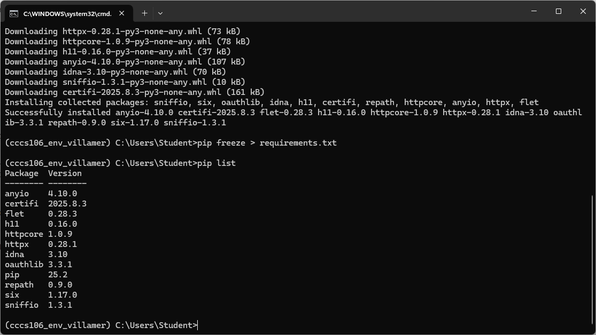
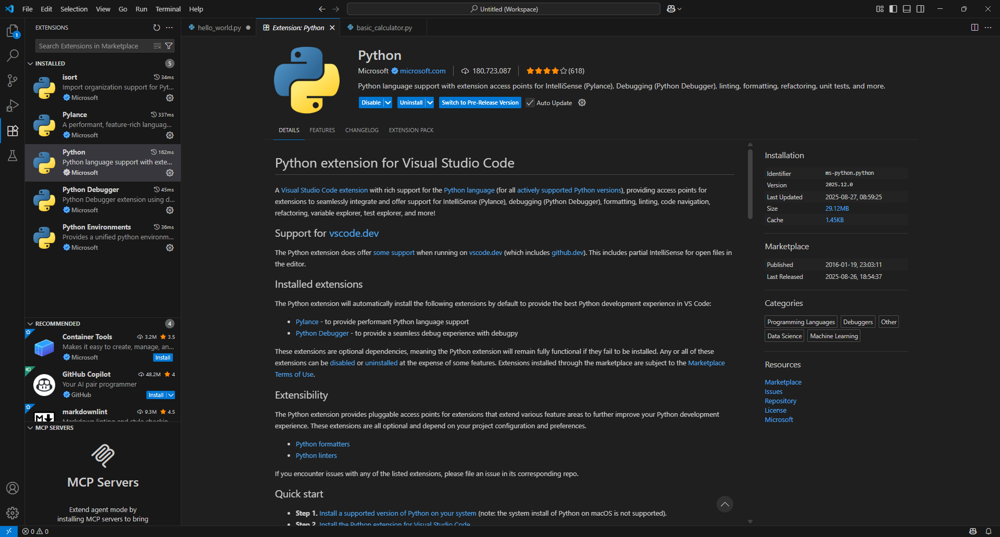
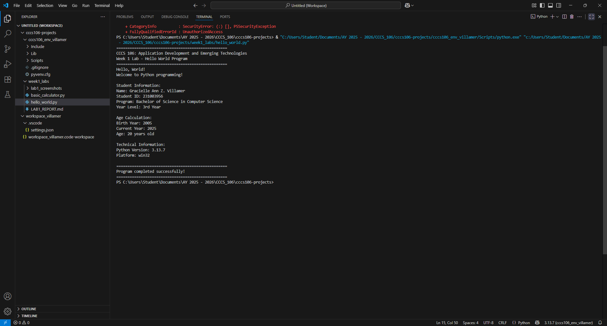
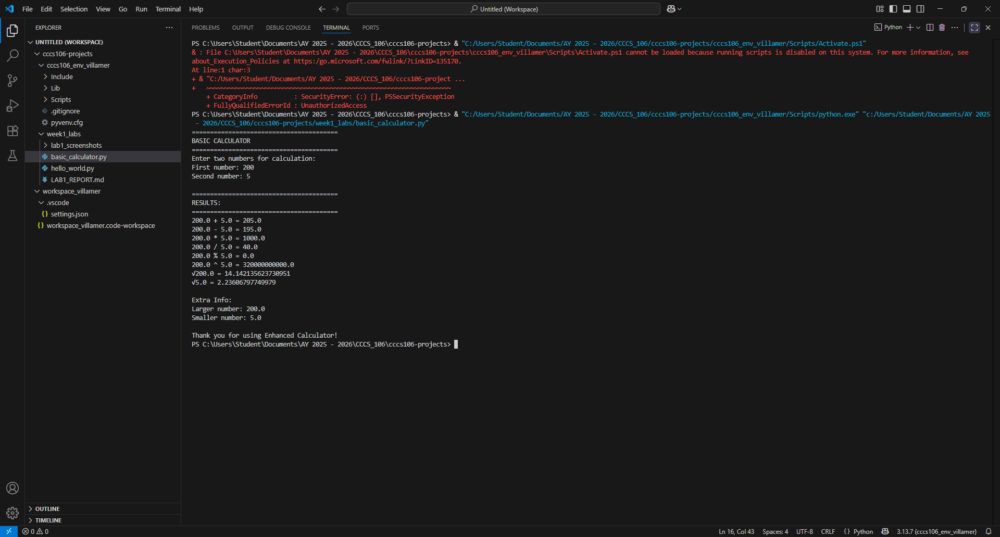

# Lab 1 Report: Environment Setup and Python Basics

**Student Name:** [Gracielle Ann Z. Villamer]
**Student ID:** [231003956]
**Section:** [3B]
**Date:** [August 27, 2025]

## Environment Setup

### Python Installation
- **Python Version:** [3.13.7]
- **Installation Issues:** [None Encountered]
- **Virtual Environment Created:** ✅ cccs106_env_villamer

### VS Code Configuration
- **VS Code Version:** [1.103.2]
- **Python Extension:** ✅ Installed and configured
- **Interpreter:** ✅ Set to cccs106_env_villamer/Scripts/python.exe

### Package Installation
- **Flet Version:** 0.28.3
- **Other Packages:** [other packages are already in the screenshot ]

## Programs Created

### 1. hello_world.py
- **Status:** ✅ Completed
- **Features:** Student info display, age calculation, system info
- **Notes:** [None]

### 2. basic_calculator.py
- **Status:** ✅ Completed
- **Features:** Basic arithmetic, error handling, min/max calculation
- **Notes:** [None]

## Challenges and Solutions

Always follow the instructions to avoid more errors.

## Learning Outcomes

I learn how to use CMD 

## Screenshots
### Environment Setup

### VsCode Setup

### Hello World

### Basic Calculator
