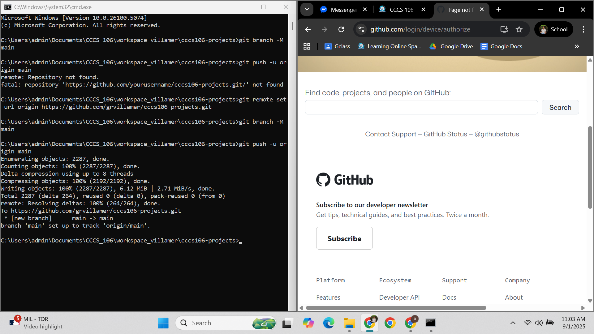
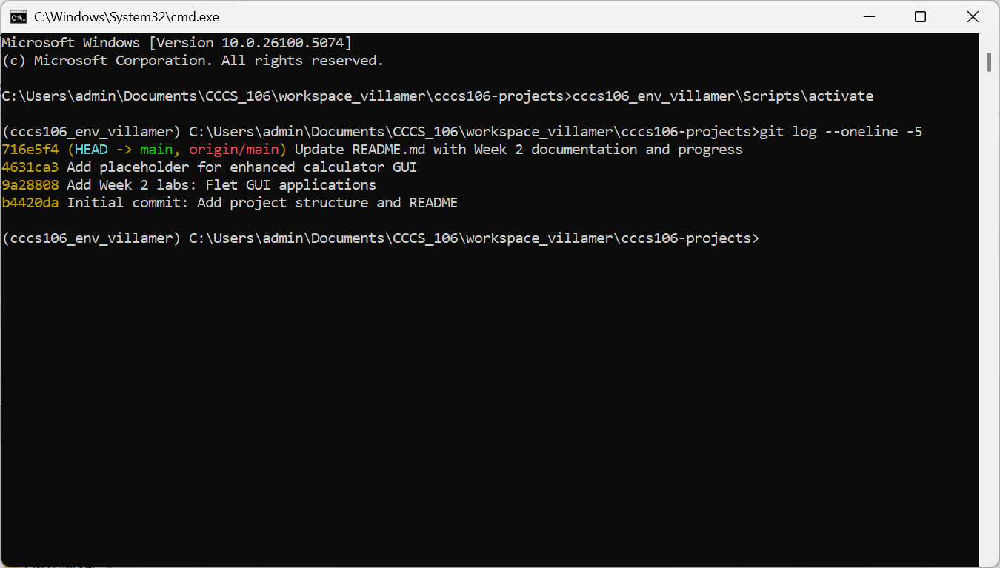
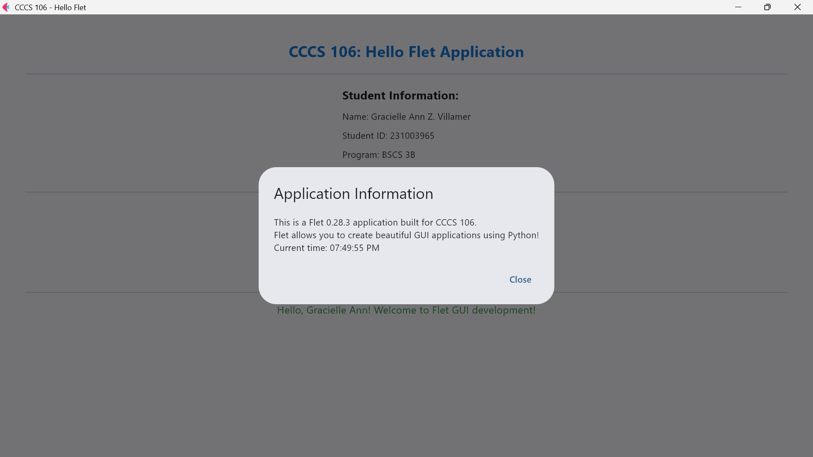
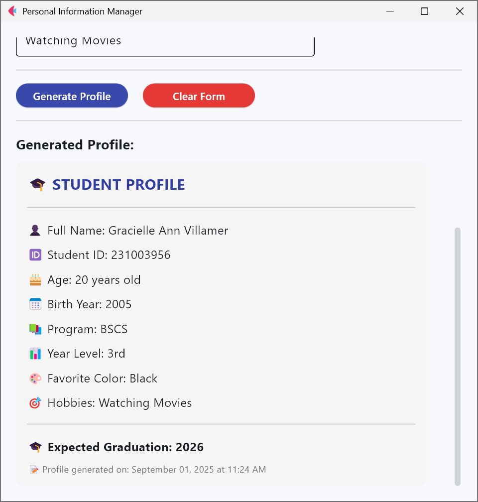

# Lab 2 Report: Git Version Control and Flet GUI Development

**Student Name:** Gracielle Ann Z. Villamer
**Student ID:** 231003956
**Section:** BSCS 3B
**Date:** 09-01-2025

## Git Configuration

### Repository Setuphttps://github.com/grvillamer/cccs106-projects
- **GitHub Repository:** 
- **Local Repository:** ✅ Initialized and connected
- **Commit History:** 4 commits with descriptive messages

### Git Skills Demonstrated
- ✅ Repository initialization and configuration
- ✅ Adding, committing, and pushing changes
- ✅ Branch creation and merging
- ✅ Remote repository management

## Flet GUI Applications

### 1. hello_flet.py
- **Status:** ✅ Completed
- **Features:** Interactive greeting, student info display, dialog boxes
- **UI Components:** Text, TextField, Buttons, Dialog, Containers
- **Notes:** None

### 2. personal_info_gui.py
- **Status:** ✅ Completed
- **Features:** Form inputs, dropdowns, radio buttons, profile generation
- **UI Components:** TextField, Dropdown, RadioGroup, Containers, Scrolling
- **Error Handling:** Input validation and user feedback
- **Notes:** None

## Technical Skills Developed

### Git Version Control
- Understanding of repository concepts
- Basic Git workflow (add, commit, push)
- Branch management and merging
- Remote repository collaboration

### Flet GUI Development
- Flet 0.28.3 syntax and components
- Page configuration and layout management
- Event handling and user interaction
- Modern UI design principles

## Challenges and Solutions

I had difficulty connecting my local repository to GitHub, especially when setting up the remote origin and pushing the initial commit. I followed the step-by-step Git commands (git remote add origin, git branch -M main, and git push -u origin main) and verified the connection using git remote -v. This ensured that the repository was linked correctly, and I was able to successfully push my commits to GitHub

## Learning Outcomes

Through this activity, I learned how to use Git and GitHub for version control, including initializing repositories, making commits, and managing branches. I also gained practical experience in Flet GUI development, such as creating interactive user interfaces, handling events, and applying layout design. Finally, I understood the importance of collaborative programming practices, where clear commit messages and organized repository structures make teamwork and project management easier.

## Screenshots

### Git Repository

### GUI Applications

## Future Enhancements

In the future, I plan to improve the applications by adding more advanced features. For the personal_info_gui.py, I could include options to upload and display a profile picture, as well as save the generated profile to a file (e.g., PDF or text). For the enhanced_calculator.py, I want to implement a fully functional GUI calculator with support for advanced operations such as multiplication, division, percentages, and memory functions. I also plan to improve the overall UI design by applying consistent color themes, responsive layouts, and better error handling for invalid inputs.